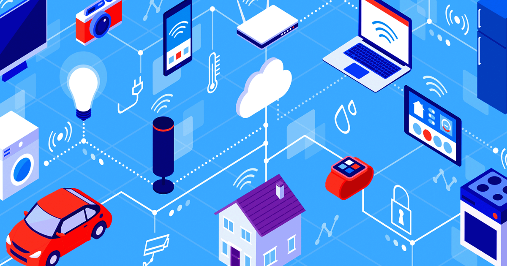

This is low-level implementation of IOT device fleet management system.

Satisfies the following requirements:
1. Register new devices with unique identifier and types(e.g. camera, thermostat etc)
2. Update device metadata
3. Receive payload from devices
4. Send control command to devices
5. Query data

